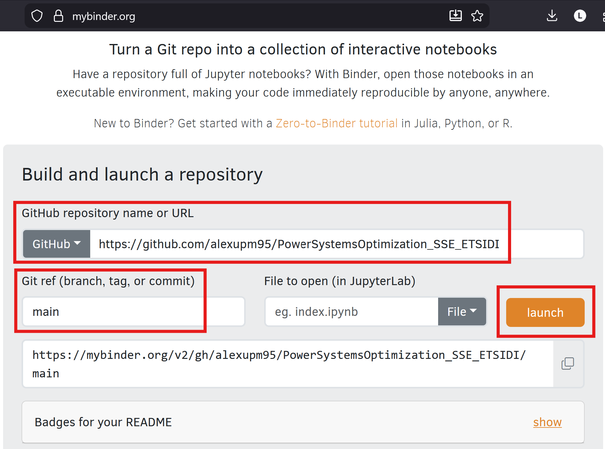
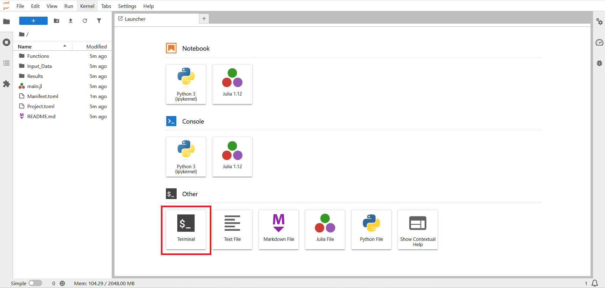
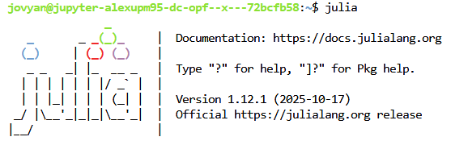
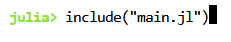
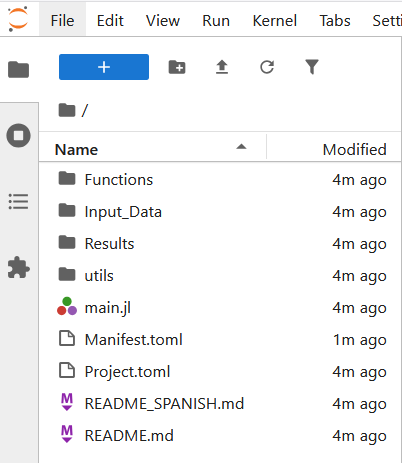
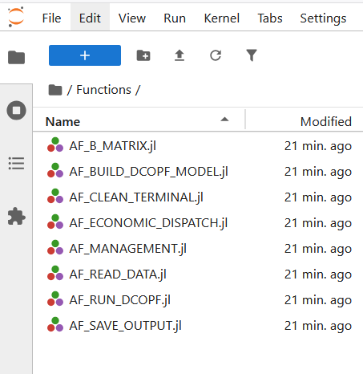
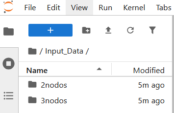

# DC-OPF and ECONOMIC DISPATCH in Julia Language
This code solves the DC-OPF and Economic Dispatch using Julia-JuMP and HiGHS solver.

## 🚀 Running the Code Online (direct without installing packages)

**1. 💻 Open the website https://mybinder.org/:**

**2. Build and Launch the Repository:**  

  
Click to see the details

  

    
  

  1. Copy and paste the repository URL (`https://github.com/alexupm95/DC-OPF_SSE_ETSIDI`) into the field **GitHub repository name or URL**.  
  2. In the field **Git ref (branch, tag, or commit)**, type `main`.  
  3. Then click on **launch**.  
  4. Wait for the server to install all requirements and precompile the packages.
     

      
     

> *Note:* **After you click `launch` on MyBinder, it builds a temporary cloud environment from the selected GitHub repository — installing dependencies and opening an interactive workspace (like Jupyter or VS Code) where you can run the code directly in your browser.**

**3. Run the Code:**  

  
Click to see the details

  1. When the server completes the installation of all the requirements, it will open a window like the one below.
      

        
      

  2. Click on `Terminal`
      

        
      

  3. In the terminal window, type `julia` and then enter
      

        
      

  4. To run the code, in the Julia Terminal type `include("main.jl")`
      

        
      

---

**4. 🗂️ Knowing the repository structure inside MyBinder:**

  
Click to see the details

  1. The root directory is composed of the following folders and files:  

      

        
      

      - 📁 [`Functions/`](./Functions): Contains all auxiliary functions used in the simulation  
      - 📁 [`Input_Data/`](./Input_Data): Contains the input data for the case studies  
      - 📁 [`Results/`](./Results): Contains all the output results  
      - 📄 [`main.jl`](./main.jl): The main script to run simulations and obtain results  
      - 📄 [`Manifest.toml`](./Manifest.toml), [`Project.toml`](../Project.toml), and [`README.md`](../README.md): Auxiliary configuration and documentation files  

  2. Getting inside the folder [`Functions/`](./Functions):
      - Inside this folder, there are eight files, which are the julia functions used during the simulation
        

          
        

  3. Getting inside the folder [`Input_Data/`](./Input_Data):
      - Inside this folder, there are two subfolders, which are the data for the test cases available (`2nodos` & `3nodos`)
        

          
        

**5. 🗂️ :**

  
Click to see the details

